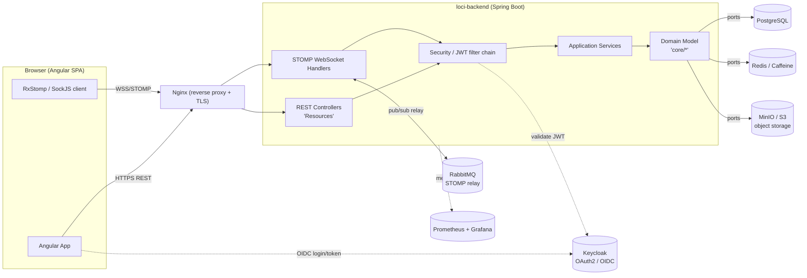
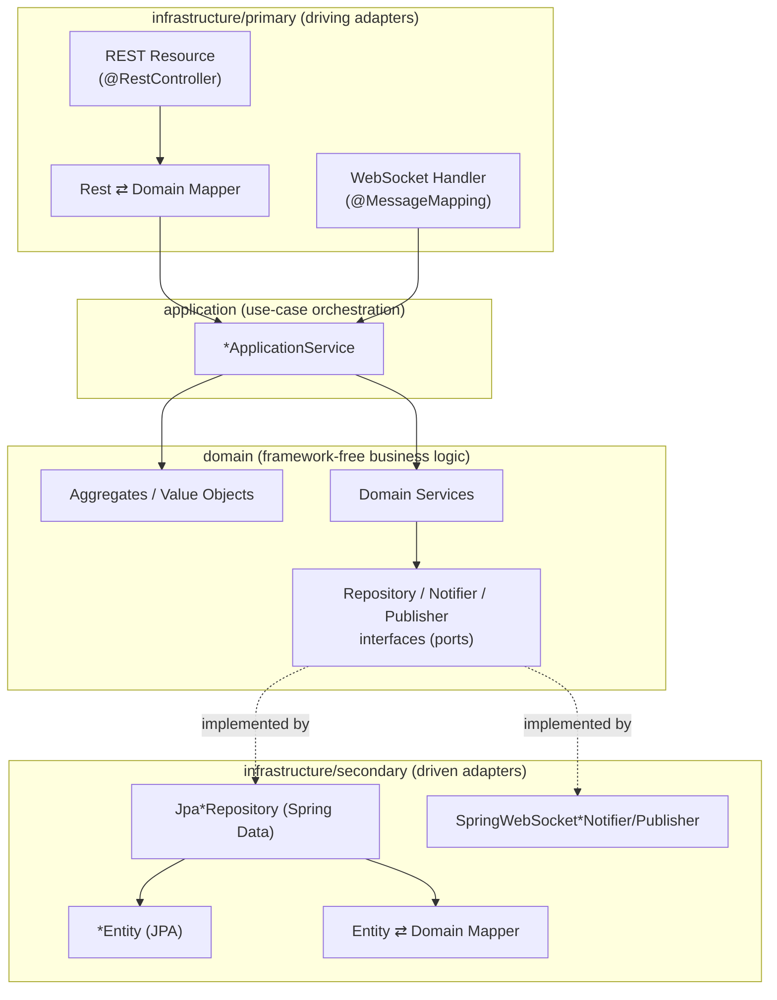
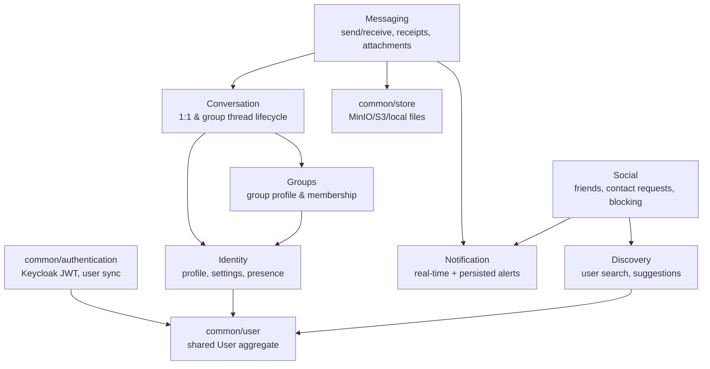
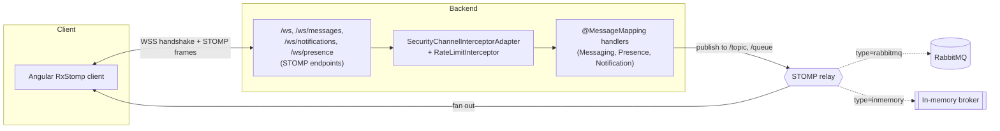

# Architecture

The backend (`loci-backend`) is built as **Hexagonal Architecture (Ports & Adapters)**
with **Domain-Driven Design** tactical patterns, organized into **bounded contexts**.
The project's own root `README.md` includes hand-drawn diagrams
(`assets/architecture.png`, `assets/hexagonal.png`, `assets/ddd-modeling.png`) — the
diagrams below express the same structure from the actual source tree.

## 1. High-level system architecture



## 2. Hexagonal layering (per bounded context)

Every business module under `core/<context>` and `common/<concern>` follows the same
three-layer shape:



- **Domain** never imports Spring/JPA/web types — only `common/ddd` contracts
  (`DomainEvent`, `ValueObject`) and validation helpers (`common/validation`).
- **Ports** are plain interfaces declared *in* the domain package
  (`domain/repository/*Repository`, `domain/repository/*Notifier`,
  `domain/repository/*Publisher`) — the domain defines what it needs, infrastructure
  provides it.
- **Primary adapters** ("driving" — things that call into the app) are REST resources
  and STOMP `@MessageMapping` handlers.
- **Secondary adapters** ("driven" — things the app calls out to) are Spring Data JPA
  repositories, MinIO/S3 storage, Redis/Caffeine caches, and the WebSocket
  publish/notify implementations.
- **Stereotype annotations** (`common/ddd/infrastructure/stereotype`:
  `@ApplicationService`, `@DomainService`, `@PrimaryPort`, `@SecondaryPort`,
  `@PrimaryMapper`, `@SecondaryMapper`, `@Acl`) make the layer of every class
  explicit and enforce the dependency direction at a glance.

## 3. Bounded context map (`core/*`)



- **`common/user`** holds the shared `User` aggregate (identity, email, names) used
  across contexts — each context (`Identity`, `Social`, `Discovery`, …) builds its own
  aggregates/value-objects *around* a `User` reference (e.g. `Friend`, `Participant`,
  `PersonalProfile`) rather than sharing a god-object.
- **Anti-corruption layers (ACL)**: `core/conversation/domain/acl/ConversationGroupAcl`
  is an explicit ACL so the Conversation context can consult Group data without
  depending on Groups' internal model — this is the DDD pattern the `@Acl` /
  `AntiDomainService` stereotypes exist for.
- **Domain events**: `core/groups/application/event/CreateGroupEvent` and
  `core/messaging/domain/event/MessageSentEvent` decouple side effects (e.g.
  notifying, presence updates) from the triggering use case via
  `SpringDomainEventPublisher`.

## 4. Real-time transport layer



- `/topic/*` destinations are **group broadcast** (e.g. `messages.receive-{conversationId}`,
  `presence.group-{id}.update`); `/queue/*` destinations are **per-user** (delivered
  via STOMP's `/user/**` convention), e.g. `messages.sent`, `notifications.new`.
- The broker relay is swappable (`stomp.relay.type: rabbitmq | inmemory`) — RabbitMQ is
  used in dev/stage for realistic pub/sub fan-out and horizontal scalability; the
  in-memory broker is a lighter-weight fallback.
- WebSocket handshake authentication and per-frame authorization run through
  `SecurityChannelInterceptorAdapter`; `RateLimitInterceptor` throttles inbound frames
  independently of the HTTP-side `RateLimitingFilter`.

## Package layout cheat sheet

```
loci_backend/
├── common/                      # cross-cutting / shared kernel
│   ├── authentication/          # Keycloak JWT verification, user sync, security filters
│   ├── cache/                   # Caffeine/Redis cache abstractions
│   ├── ddd/                     # DDD tactical building blocks & stereotypes (framework-free)
│   ├── jpa/                     # shared JPA base classes (auditing, paging)
│   ├── log/                     # AOP-based execution logging
│   ├── migration/               # one-off Keycloak user migration (Spring Shell command)
│   ├── store/                   # file storage port + Minio/S3/local adapters
│   ├── user/                    # shared User aggregate + repository
│   ├── validation/              # domain assertions, RFC7807 ProblemDetail error mapping
│   ├── websocket/                # STOMP config, security, broker autoconfiguration
│   └── wire/                     # Spring @Configuration classes wiring the above together
└── core/                         # bounded contexts (business capabilities)
    ├── identity/                 # profile, settings, presence
    ├── social/                   # friends, contact requests, blocking
    ├── discovery/                 # search, suggestions
    ├── conversation/             # conversation lifecycle
    ├── groups/                   # group profile & membership
    ├── messaging/                 # message send/receive/receipts/attachments
    └── notification/              # notifications
```

Each `core/<context>` and most of `common/<concern>` follows:
`application/ · domain/{aggregate,vo,repository,service,exception,event,acl}/ · infrastructure/{primary,secondary}/`.
