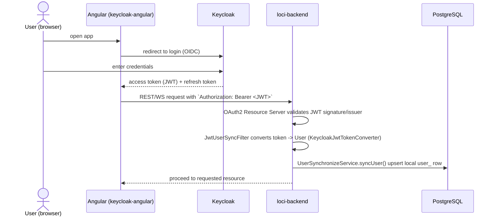
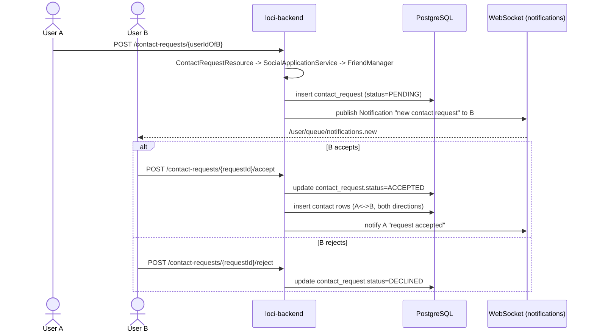
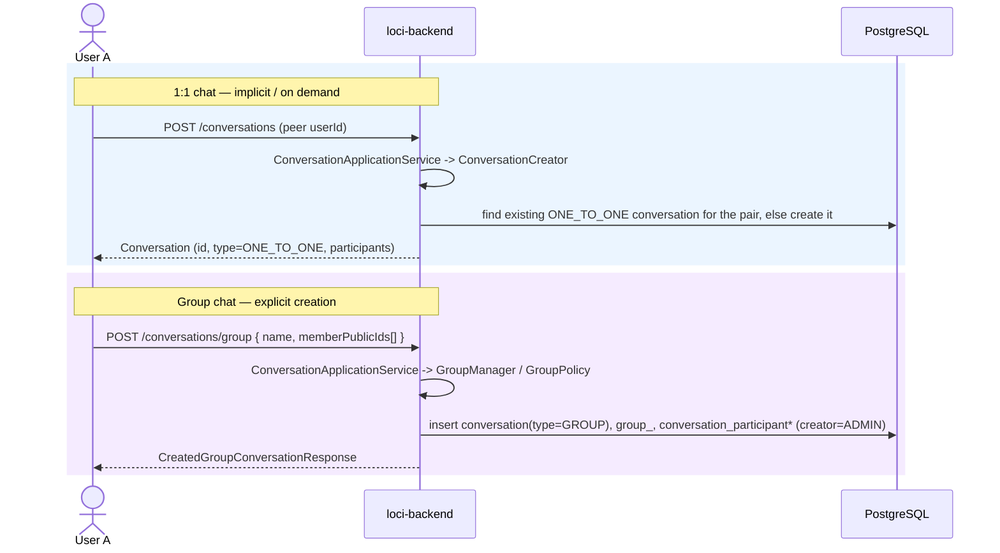
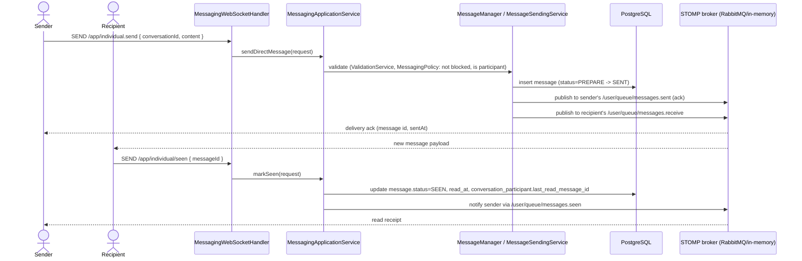
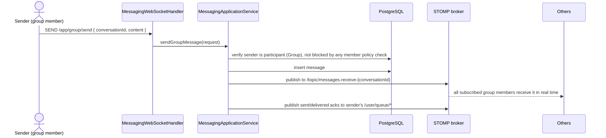
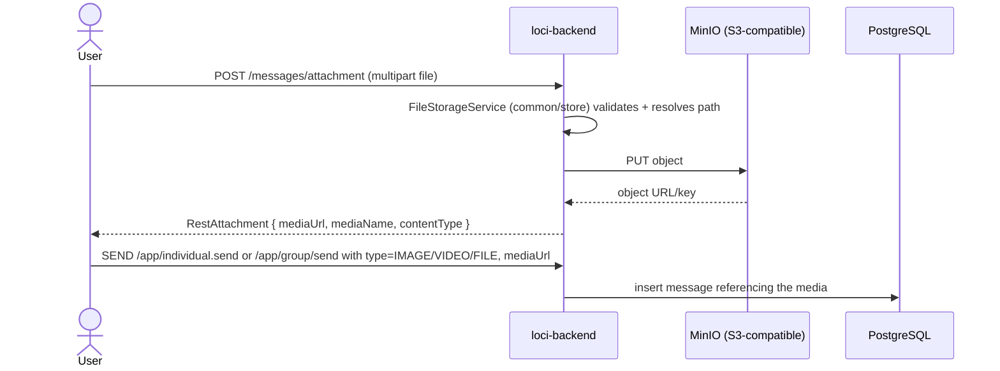
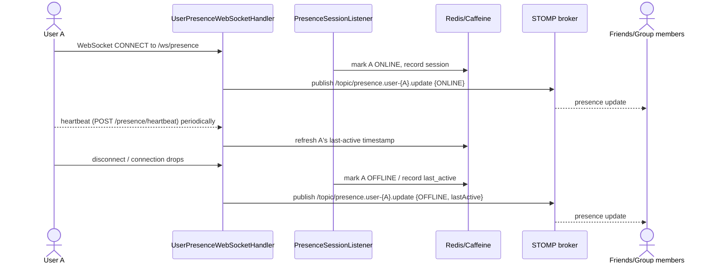
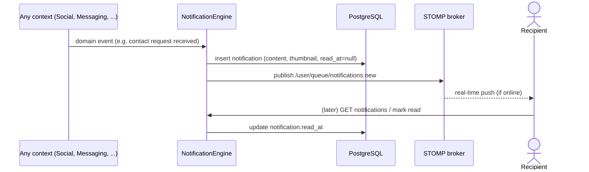

# Business Flows

Sequence diagrams for the primary user journeys, traced against the actual
controllers/handlers/services in `loci-backend` (see file references under each
diagram).

## 1. Authentication & first-request user sync

Loci does not have its own login form — Keycloak owns authentication. The backend's
job is to **trust the JWT** and keep a local mirror of the user for fast relational
queries (friends, conversations, etc. all join against local `user_.id`).

Key files: `common/authentication/infrastructure/primary/filter/JwtUserSyncFilter.java`,
`.../keycloak/KeycloakJwtTokenConverter.java`,
`common/user/domain/service/UserSynchronizeService.java`,
`common/authentication/infrastructure/primary/config/SecurityConfiguration.java`.

WebSocket connections are authenticated separately at STOMP CONNECT time via
`SecurityChannelInterceptorAdapter` + `WebSocketAuthenticationManager`
(`common/websocket/infrastructure/primary/security/`), using the same bearer token
passed as a STOMP header.

## 2. Becoming friends (contact request lifecycle)

Key files: `core/social/infrastructure/primary/resource/ContactRequestResource.java`,
`core/social/application/SocialApplicationService.java`,
`core/social/domain/service/FriendManager.java`,
`core/social/domain/aggregate/{ContactRequest,ContactConnection}.java`.

A `FriendshipStatus`/`FriendRequestStatus` state machine backs this
(`PENDING → ACCEPTED | DECLINED | CANCELED`); either side can also cancel a pending
outgoing request via `DELETE /contact-requests/{userId}`.

Related: **Discovery** (`core/discovery`) powers `GET /users/search` and
`GET /users/suggests`, which is how User A finds User B in the first place, and
**Blocking** (`BlockUserResource`) lets either party cut off contact regardless of
friendship state — `MessagingPolicy`/`UserIsBlockedByOtherException` enforce that a
blocked relationship prevents new messages.

## 3. Starting a conversation

Two entry points, both producing a `Conversation` aggregate:

Key files: `core/conversation/infrastructure/primary/resource/ConversationResource.java`,
`core/conversation/domain/service/{ConversationCreator,ConverationManagerService}.java`,
`core/groups/domain/service/{GroupManager,GroupMembershipService,GroupPolicy}.java`,
`core/groups/domain/factory/ConversationParticipantFactory.java`.

A user's conversation list (`GET /conversations/user/{userId}`) returns a
`UserChatList` — each entry carries the last message preview and unread count
(`ConversationUnreadMessageCount`), used to render the chat inbox.

## 4. Sending & receiving a direct (1:1) message

The primary interactive real-time path — REST is available as a fallback/initial
send, but STOMP is the live channel both sender and receiver actually listen on.

Key files: `core/messaging/infrastructure/primary/handler/MessagingWebSocketHandler.java`,
`core/messaging/application/MessagingApplicationService.java`,
`core/messaging/domain/service/{MessageSendingService,MessageManager,MessageTrackingStateService,MessagingPolicy}.java`,
`core/messaging/infrastructure/secondary/realtime/SpringWebSocketDirectMessage{Notifier,Publisher}.java`,
`common/websocket/infrastructure/WsPaths.java` (`INDIVIDUAL_*` destinations).

`MessageState`/`MessageStatus` model the lifecycle: `PREPARE → SENT → DELIVERED → SEEN`.
A `MessageSentEvent` domain event fires on successful send, which is how
downstream concerns (e.g. notification/analytics) can react without coupling into the
sending code path.

REST equivalents exist for non-realtime/initial-load use: `POST
/messages/individual/send`, `PATCH /messages/individual/receive`, and
`GET /conversations/{id}/messages` (paginated history via `MessageCursorQuery`),
`PATCH /conversations/{id}/messages/seen` (bulk mark-as-read).

## 5. Sending a group message

Same shape as 1:1, but fan-out is to a **topic** (all group members) instead of a
single recipient queue:

Key files: `core/messaging/infrastructure/primary/resource/GroupMessageResource.java`,
`core/messaging/infrastructure/secondary/realtime/SpringWebSocketGroupMessage{Notifier,Publisher}.java`,
`core/groups/domain/service/GroupPolicy.java` (who may post in a group).

## 6. Media/attachment upload

Key files: `core/messaging/infrastructure/primary/resource/MessageResource.java`,
`common/store/domain/service/FileStorageService.java`,
`common/store/infrastructure/secondary/minio/MinioObjectStorage.java`,
`common/store/infrastructure/secondary/s3/S3FileService.java` (alternate adapter),
`common/store/infrastructure/secondary/local/LocalObjectStorage.java` (dev fallback).

## 7. Presence tracking

Key files: `core/identity/infrastructure/primary/handler/UserPresenceWebSocketHandler.java`,
`core/identity/infrastructure/primary/listener/PresenceSessionListener.java`,
`core/identity/domain/service/{PresenceIndicator,UserPresenceService}.java`,
`core/identity/infrastructure/secondary/repository/CacheUserPresenceRepository.java`,
`core/identity/infrastructure/primary/resource/PresenceResource.java`
(`GET /presence/{userId}`, `GET /presence` bulk, `POST /presence/heartbeat`,
`POST /presence/offline`).

Group-level presence (who in a group is currently online) is a separate concern in
`core/groups` (`GroupPresence`, `SpringWebSocketGroupPresenceNotifier`,
`STOMPPresenceTrackingOperations`), broadcast to `/topic/presence.group-{id}.update`.

## 8. Notifications

Key files: `core/notification/domain/service/NotificationEngine.java`,
`core/notification/infrastructure/secondary/realtime/{SpringWebSocketNotificationPublisher,STOMPPushNotificationOperations}.java`,
`core/notification/infrastructure/primary/handler/NotificationWebSocketHandler.java`.

This is intentionally decoupled: any bounded context can trigger a notification
without depending on how it's delivered — it's persisted (so it survives being
offline) *and* pushed live (so it's instant when online).
