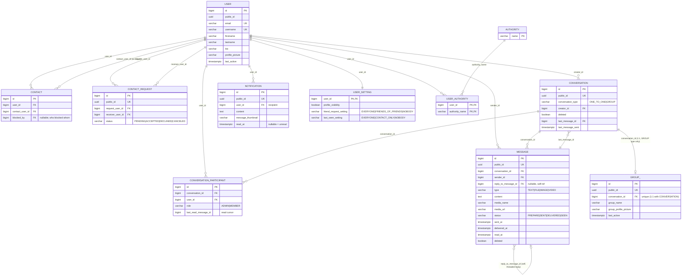

# Data Model

Source of truth: `loci-backend/src/main/resources/db/migrations/V1__baseline.sql`
(Flyway-managed; PostgreSQL). All primary keys are `bigint` sequences; most tables
also carry a public-facing `uuid` (`public_id`) so internal IDs never leak into the
API/URLs.

## Entity-relationship diagram

## Notes / conventions

- **Soft delete**: `conversation.deleted` and `message.deleted` are boolean flags —
  rows are not physically removed, allowing message history to stay consistent for
  other participants even if one side "deletes" a conversation from their own view.
- **Public IDs**: every externally-addressable aggregate root exposes a `uuid
  public_id` in the REST/WS payloads instead of the internal `bigint` sequence id —
  see `common/translation/IdTranslator` and per-context `*IdTranslator` ports, plus
  `common/user/domain/vo/PublicId.java`.
- **`CONTACT` is directional-but-symmetric**: accepting a contact request inserts
  contact rows so the relationship is queryable from either `user_id` or
  `contact_user_id`; `blocked_by` records which side (if any) has blocked the
  relationship without deleting the row (so unblocking restores the friendship).
- **1:1 vs. group conversations share one table** (`conversation`), discriminated by
  `conversation_type`; a `GROUP` conversation additionally has exactly one `group_`
  row (name/photo), whereas `ONE_TO_ONE` does not.
- **Read receipts** are modeled two ways simultaneously: per-message
  (`message.status`, `read_at`) for the classic "seen" tick, and per-participant
  (`conversation_participant.last_read_message_id`) as a cursor for unread-count
  queries (`ConversationUnreadMessageCount`) without scanning every message.
- **`data.sql`** (alongside `V1__baseline.sql`) seeds baseline reference data
  (e.g. `authority` rows) on startup in dev-oriented profiles.
